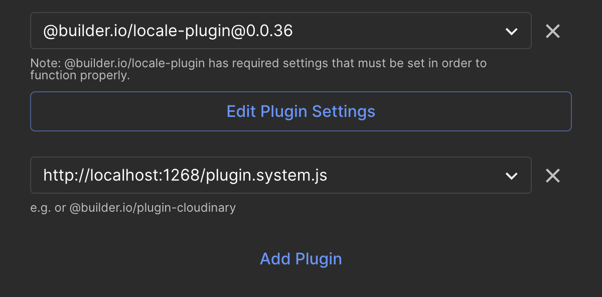
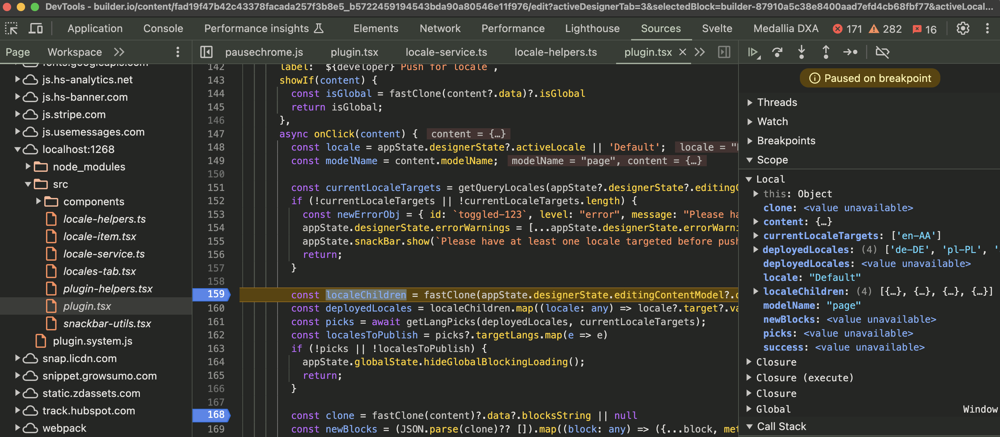

# Push To Locale plugin

## instructions for development

## change the function to your name

- replace (dev=<yourname>) with your developer name in push to locale register
  plugin action.
- start your dev server

```sh
# pass your developer name so that you can work locally without conflicting
dev=sid yarn run start
```

## Steps in builder.io

- Login to builder.io
- Access the space SE.com SQE [https://builder.io/account/organization]
- go to plugins and click edit 
- click on the plugin settings - copy the private key
- click cancel
- click on add plugin
- add localhost:1268/plugin.system.js

## Test it

- Create a new page
- when the page is in draft the 3 dots should show an option
  
- open the browser developer options
  
- Click on (your name) push to locale
- open browser console

## Start debugging

- Set debugger and since sourcemaps are available , you can debug easily.

## Pending items

- [ ] Images coming from DAM are removed from Local Page when we do a push or
      repush and throws an error and	Same with URL fields which got removed from
      Local page and it becomes a “Document Link”.
- [ ] All the content under slide/cards for local page are created as empty like
      text, URL and image fields.
- [ ] Local country slides persists but, sometime duplicate slides start appears
      after repush.
- [ ] Deleting Global side from local page is not working. As after repush from
      Global slide start appearing again on local page.
- [ ]Automatic publish of the local page after every repush is still happening.
